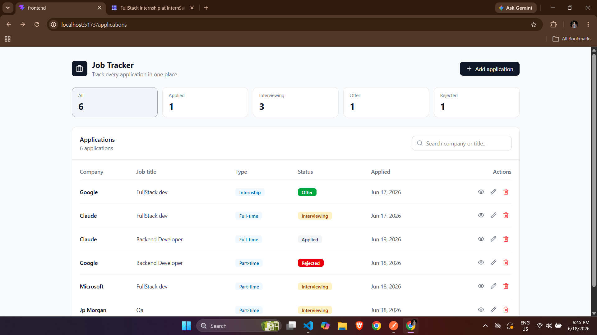
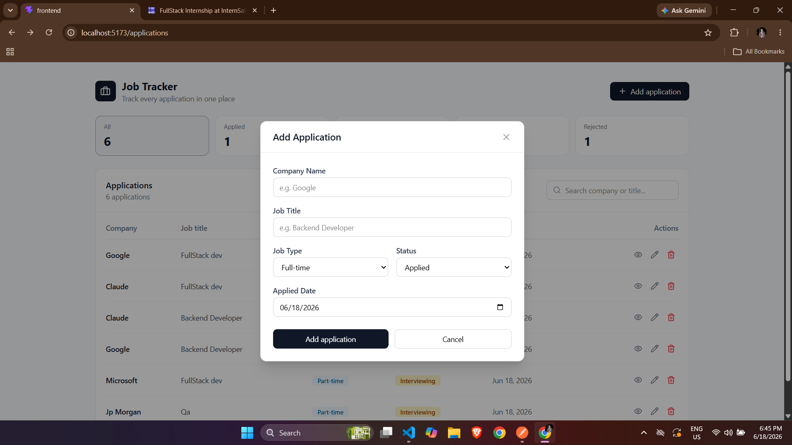

# Job Application Tracker

## Project Overview

A full-stack Job Application Tracker that allows users to manage job applications in one dashboard. Users can create, view, update, and delete applications while tracking application status, job type, company Name, and application dates.

## Features

* Create job applications
* View all applications in a dashboard
* Edit application details
* Delete applications
* View application details
* Status tracking (Applied, Interview, Offer, Rejected)
* Responsive UI

---

## Tech Stack

### Frontend

* React
* TypeScript
* Redux Toolkit
* Tailwind CSS
* Axios
* React-router-dom

### Backend

* Node.js
* Express.js
* PostgreSQL

---

## Project Structure

```text
frontend/
backend/
```

---

## Prerequisites

Before running the project, make sure you have:

* Node.js (v18+ recommended)
* npm
* PostgreSQL

---

## Installation

### Clone Repository

```bash
git clone https://github.com/manishjk08/Job-tracker-.git
cd YOUR_REPOSITORY
```

### Backend Setup

```bash
cd backend
npm install
```

Create a `.env` file:

```env
PORT=5000

```

Start backend:

```bash
npm run dev
```

### Frontend Setup

```bash
cd frontend
npm install
```

Create a `.env` file:

```env
VITE_API_URL=http://localhost:5000/api
```

Start frontend:

```bash
npm run dev
```

---

## Development Mode

Backend:

```bash
npm run dev
```

Frontend:

```bash
npm run dev
```

---

## Running Tests

No automated tests are currently included.

---

## Environment Variables

### Backend

```env
PORT=

```

### Frontend

```env
VITE_API_URL=
```

---

## .env.example

### backend/.env.example

```env
PORT=5000

```

### frontend/.env.example

```env
VITE_API_URL=http://localhost:5000/api
```

---

## API Documentation

Base URL:

```text
http://localhost:5000/api
```

### Endpoints

#### Get All Applications

```http
GET /applications
```

#### Get Single Application

```http
GET /applications/:id
```

#### Create Application

```http
POST /applications
```

#### Update Application

```http
PUT /applications/:id
```

#### Delete Application

```http
DELETE /applications/:id
```

---

## Screenshots

### Dashboard

Add screenshot here:

```md

```

### Application Form

```md

```

### Application Details

```md

```

---

## GitHub Repository

```text
https://github.com/manishjk08/Job-tracker-
```
